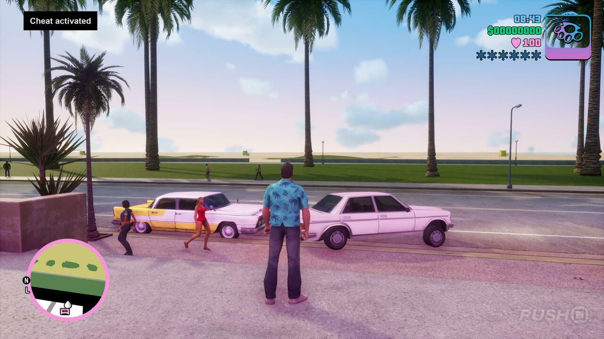

# Vice City API
"It's Lazlow on V-ROCK!"



## Usage
### Local 
To install the app locally
```shell
uvicorn api.router:app --reload
```

### All stations
```shell
curl -X GET http://127.0.0.1:8000/stations/
```
### Specific station
```shell
curl -X GET http://127.0.0.1:8000/stations/K-Chat
```